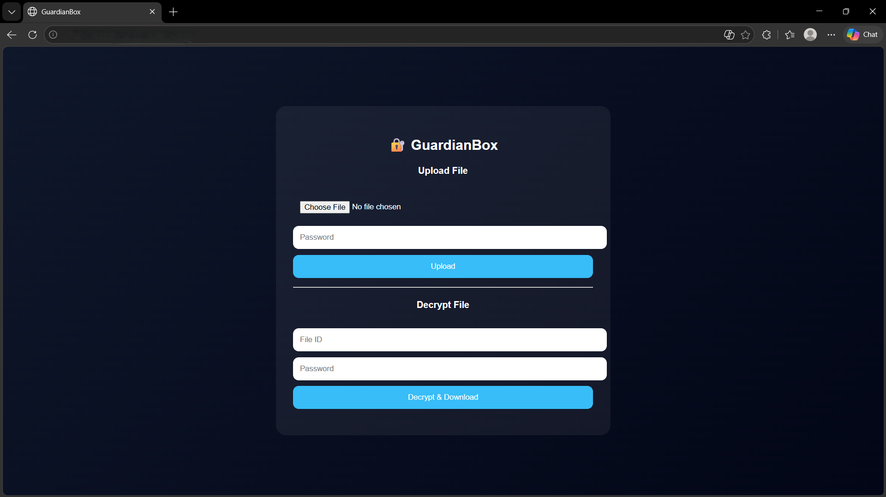
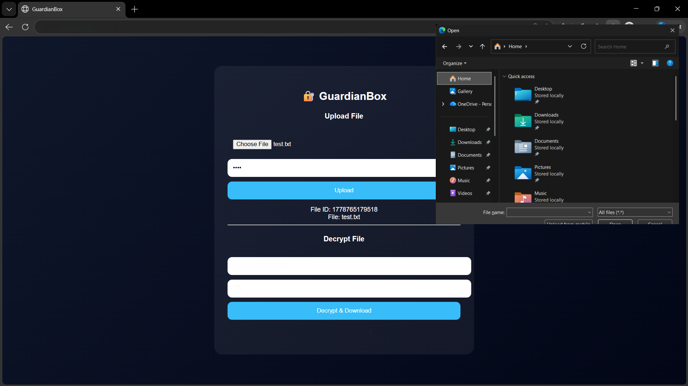
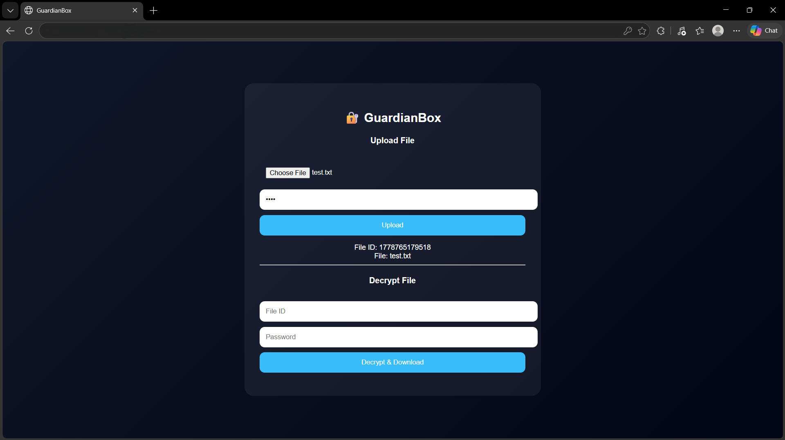

# 🔐 GuardianBox - End-to-End Encrypted File Sharing

## 📌 Overview
GuardianBox is a secure file sharing system where files are **encrypted before storage** and can only be decrypted using a password. The server never has access to the original file content.

---

## ⚙️ Features
- 🔐 AES-256 Encryption (Crypto module)
- 📤 Secure File Upload
- 🔑 Password-based Decryption
- 📁 Original filename restoration
- 🌐 Simple web interface
- 🚫 Server cannot read file content (zero-knowledge design)

---

## 🧠 How It Works

### 1. Upload
- User selects file
- Enters password
- File is encrypted using AES-256
- Encrypted file stored on server

### 2. Storage
- Only encrypted `.bin` file is saved
- Original file is deleted from server

### 3. Decryption
- User enters file ID + password
- Server decrypts file
- File is downloaded in original format

---

## 🛠️ Tech Stack
- Node.js
- Express.js
- Multer (file handling)
- Crypto (AES encryption)
- HTML, CSS, JavaScript

---

## 🔐 Security Concept
- End-to-End Encryption
- Zero-Knowledge Storage
- Password never stored on server

---

## 🚀 How to Run

### Backend
```bash
cd backend
node server.js

```

## Screenshots

### Home Page


### Encrypted Upload


### Upload Page


### 4. Decrypt & Download

